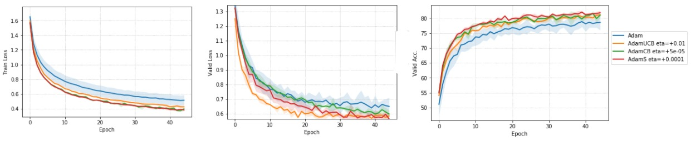
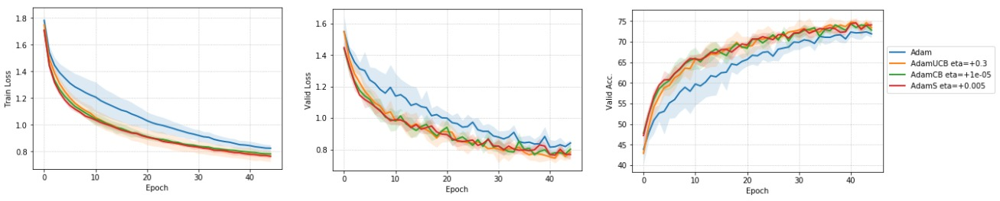
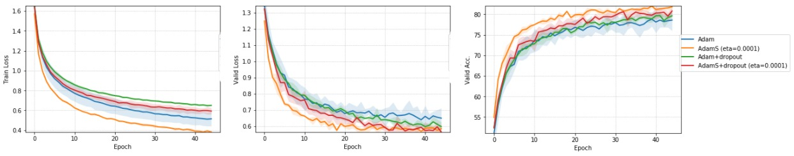
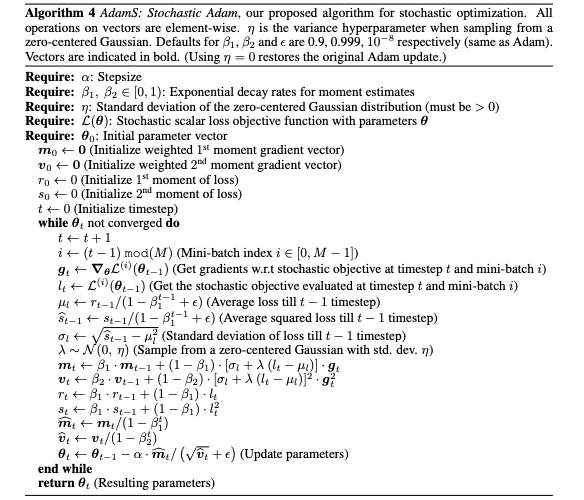
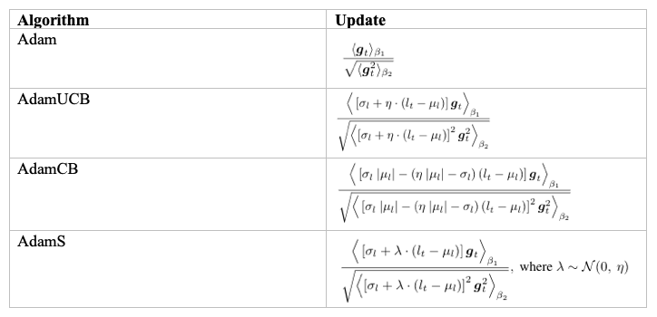

## Official implementation of the *AdamS* Optimizer for PyTorch

From the paper: *[Exploiting Uncertainty of Loss Landscape for Stochastic Optimization](http://arxiv.org/abs/1905.13200)*  

Cite as: 
> *V.S. Bhaskara, and S. Desai. arXiv preprint, arXiv:1905.13200 [cs.LG] (2019).*

### Usage

The usage is identical to the [Adam](https://docs.pytorch.org/docs/2.8/generated/torch.optim.Adam.html) optimizer, except that `optimizer.step()` requires a function returning the loss tensor, and an additional exploration parameter `eta` must be specified. This parameter controls the standard deviation of the noise injected into the gradients along highly uncertain directions of the loss landscape. Higher value of `eta` is preferred for more noisy datasets.

Example:

```python
from optimizers.adams import AdamS

# eta specifies the exploration parameter (use higher eta for more noisy datasets)
# set `decoupled_weight_decay` to True for AdamW-style weight decay
optimizer = AdamS(model.parameters(), 
                  lr=1e-3, 
                  eta=0.0001, 
                  weight_decay=0,
                  decoupled_weight_decay=False)

# training loop
...
# compute output and loss
outputs = model(inputs)
loss = criterion(outputs, targets)

# optimizer
optimizer.zero_grad()
loss.backward()
optimizer.step(lambda: loss)  # pass a lambda function that returns the loss tensor
...
```


### Code

PyTorch implementations of the Adam optimizer variants introduced in the paper are available under [``optimizers/``](optimizers/).

The **AdamS** optimizer for PyTorch is available [here](optimizers/AdamS.py). 

Tested on `Python <= 3.12.3` and `PyTorch <= 2.7.0`.

### Experiments

We evaluated the optimizers on multiple models such as Logistic Regression (LR), MLPs, and CNNs on the CIFAR-10/MNIST datasets. The architecture of the networks is chosen to closely resemble the experiments published in the original Adam paper [(Kingma and Ba, 2015)](https://arxiv.org/abs/1412.6980). Code for our experiments is available under [``experiments/``](experiments/), and is based on the original CIFAR-10 classifier code [here](https://github.com/bearpaw/pytorch-classification).

#### Reproducing the results

* Run the shell script for each type of model (LR/MLP/CNN) under [``experiments/``](experiments/)
* Compute the Mean and the Standard Deviation of the training/validation metrics for each configuration across the three runs. 

Results of our training runs with the mean and the standard deviation values for each configuration is provided under [``experiments/results_mean_std/``](experiments/results_mean_std).

### Results

#### CNN trained on CIFAR-10 with batch size = 128 and no dropout



#### CNN trained on CIFAR-10 with batch size = 16 and no dropout




#### Comparison of Dropout with AdamS for CNN trained on CIFAR-10 with batch size = 128 




### Algorithm 

We introduce variants of the [Adam](https://docs.pytorch.org/docs/2.8/generated/torch.optim.Adam.html) optimizer that either bias the updates along regions that conform across mini-batches or randomly *explore* unbiased in the parameter space along the variance-gradient. Our variants of the optimizer are shown to generalize better with improved test accuracy across multiple datasets and architectures. Particularly, our optimizer shines in low-data regime and when the data is noisy, sparse/redundant, or missing. 

Please refer to the [paper](http://arxiv.org/abs/1905.13200) for more details.

#### The AdamS Optimization Algorithm



We recommend using the [*AdamS*](optimizers/adams.py) optimizer with unbiased gradients, which outperforms the other variants introduced in the paper based on our experiments.


### Update Rules

The update rules for various variants of Adam in the paper are summarized below: 

  

AdamUCB and AdamCB are biased estimates of the full-gradient. We recommend using AdamS which is an unbiased estimate, and outperforms other variants based on our experiments with CIFAR-10. 

Please refer to the [paper](http://arxiv.org/abs/1905.13200) for more details.


### Why the variance of the loss and not the variance of the gradient?

A natural alternative is to use the variance of the gradient across mini-batches as the uncertainty signal, since optimization happens in gradient space. We choose the variance of the loss for two reasons.

First, the two quantities measure different things. Consider parameters at a point where the per mini-batch loss surfaces agree on the value of the loss but are locally jagged, at small length scales in parameter space, in different directions across mini-batches. The mini-batch gradients can then disagree strongly even though the mini-batch loss values are close: gradient variance is high, loss variance is small. As an uncertainty signal for whether the mini-batches agree on the loss landscape at the current point, the variance of the loss is the macro-level quantity, whereas the variance of the gradient is more sensitive to local jaggedness that does not necessarily reflect meaningful disagreement in loss values. The same argument can run the other way: when loss values disagree but gradients happen to align, gradient variance can underreport disagreement that is visible in the loss values.

Second, the natural concern that loss variance depends on the scale of the loss is largely absorbed by Adam-style normalization. The update uses the loss only through a centered-and-normalized quantity: current loss minus running mean loss, divided by running loss standard deviation. This quantity is invariant to multiplicative rescaling of the loss, and Adam's RMSprop-like denominator further cancels the remaining global scaling of the gradient. The resulting updates are therefore approximately invariant to the scale of the loss.


### Contribute

Feel free to create a pull request if you find any bugs or you want to contribute (e.g., more datasets, more network structures, or tensorflow/keras ports). 
